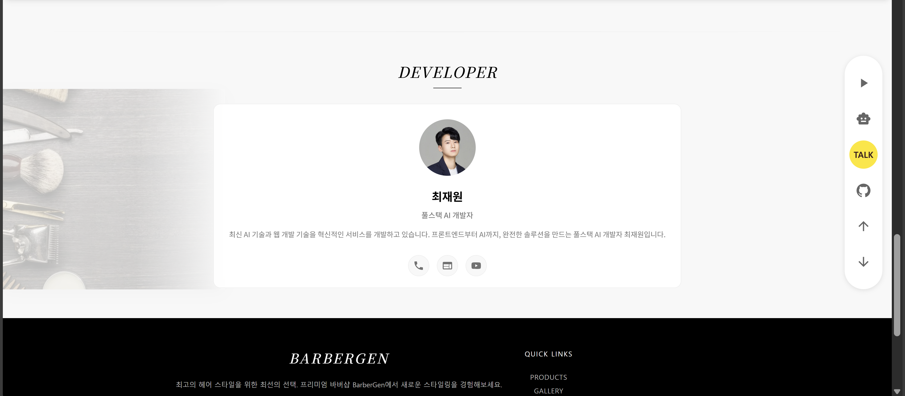

# ✂️ **BarberGen**

> **새로운 세대의 신사 문화를 생성하다**  
> 전통적인 바버샵 문화와 AI 기술이 만나는 혁신적인 남성 그루밍 플랫폼


## 🎯 **BarberGen**이란?

**BarberGen**은 단순한 이름이 아닌, 우리의 비전을 담은 의미있는 조합입니다.
**Barber**란
신사들의 사교 공간이자, 남성 그루밍 문화의 성지입니다.
숙련된 바버의 손길, 클래식한 면도 의식, 그리고 세대를 아우르는 남자들만의 대화가 이루어지는 곳입니다.
**Gen**은 세 가지 의미를 품고 있습니다:
- **🌟 Generation** - 새로운 세대의 신사 문화를 이끌어갑니다
- **⚡ Generate** - AI 기술로 개인 맞춤형 그루밍 솔루션을 생성합니다  
- **👔 Gentleman** - 진정한 신사(Gent)의 품격을 추구합니다

---

## 📋 프로젝트 개요

**개발 진행 상황**: 🚧 **현재 개발 중** 🚧

**BarberGen**은 전통적인 바버샵의 장인정신과 최신 AI 기술을 결합하여, 현대 남성들에게 개인화된 그루밍 경험을 제공하는 혁신적인 플랫폼입니다.

## 🖼️ 서비스 미리보기

<div align="center">
  
  
</div>

<div align="center">
  
  
</div>

### ✨ 핵심 가치

🎯 **개인화된 그루밍**: AI가 분석한 얼굴형, 헤어 타입, 라이프스타일에 맞는 맞춤형 스타일 제안  
🏛️ **전통과 혁신의 조화**: 클래식한  문화와 현대적 기술의 완벽한 융합  
🤝 **커뮤니티 중심**: 신사들이 모여 스타일과 경험을 공유하는 디지털 사교 공간  
📱 **접근성**: 언제 어디서나 전문가 수준의 그루밍 조언을 받을 수 있는 편의성

### 🎨 주요 기능 (예정)

- [ ] **AI 스타일 컨설턴트**: ComfyUI 기반 얼굴형 분석 및 헤어스타일 시뮬레이션
- [ ] **바버 매칭 시스템**: 내 스타일과 위치에 맞는 전문 바버 추천
- [ ] **신사 커뮤니티**: 스타일 팁 공유
- [ ] **예약 통합 시스템**: 선호하는 바버샵 실시간 예약
- [ ] **스타일 히스토리**: 내 그루밍 변천사 기록 및 분석

## 🏗️ 기술 스택

### Frontend - 현대적 사용자 경험
- **React** 
- **Material-UI** - 세련된 바버샵 감성의 디자인

### Backend - 안정적인 서비스 기반
- **FastAPI** - 고성능 Python 웹 프레임워크
- **Uvicorn** - 비동기 서버 환경

### Database & Auth - 안전한 데이터 관리
- **Firebase Firestore** - 실시간 데이터 동기화
- **Firebase Auth** - 소셜 로그인 및 보안 인증
- **Firebase Storage** - 스타일 이미지 및 미디어 저장

### AI/ML - 지능형 그루밍 솔루션
- **ComfyUI** - Stable Diffusion 기반 이미지 처리 기능능
- **Python ML Libraries** - 얼굴형 분석 및 스타일 추천 알고리즘

## 🌟 개발 로드맵

### Phase 1: 기반 구축 (진행 중)
- [ ] React + TypeScript 프로젝트 초기 설정
- [ ] FastAPI 서버 아키텍처 구성
- [ ] Firebase 프로젝트 통합
- [ ] 기본 사용자 인증 시스템
- [ ] 반응형 UI/UX 디자인 시스템

### Phase 2: AI 스타일 엔진
- [ ] ComfyUI 워크플로우 개발
- [ ] 얼굴형 분석 AI 모델 통합
- [ ] 개인화 추천 알고리즘
- [ ] 스타일 시뮬레이션 인터페이스

### Phase 3: 커뮤니티 플랫폼
- [ ] 바버 프로필 및 포트폴리오 시스템
- [ ] 사용자 리뷰 및 평점 시스템
- [ ] 스타일 공유 커뮤니티
- [ ] 실시간 채팅 및 상담
- [ ] 예약 및 결제 시스템

### Phase 4: 고급 기능
- [ ] AR 헤어스타일 체험
- [ ] 개인 그루밍 코치 AI
- [ ] 제품 추천 및 쇼핑 연동
- [ ] 바버샵 파트너십 프로그램
- [ ] 모바일 앱 출시

## 📁 프로젝트 구조

```
barbergen/
├── frontend/                 # React 클라이언트
│   ├── src/
│   │   ├── components/      # UI 컴포넌트
│   │   │   ├── common/     # 공통 컴포넌트
│   │   │   ├── barber/     # 바버 관련
│   │   │   └── style/      # 스타일링 관련
│   │   ├── pages/          # 페이지 컴포넌트
│   │   │   ├── auth/       # 인증 페이지
│   │   │   ├── profile/    # 프로필 관리
│   │   │   ├── style/      # 스타일 시뮬레이션
│   │   │   └── community/  # 커뮤니티
│   │   ├── hooks/          # 커스텀 훅
│   │   ├── services/       # API 서비스
│   │   └── utils/          # 유틸리티
├── backend/                  # FastAPI 서버
│   ├── app/
│   │   ├── api/            # API 엔드포인트
│   │   │   ├── auth/       # 인증 API
│   │   │   ├── users/      # 사용자 관리
│   │   │   ├── barbers/    # 바버 관리
│   │   │   └── styles/     # 스타일 API
│   │   ├── models/         # 데이터 모델
│   │   ├── services/       # 비즈니스 로직
│   │   │   ├── ai/         # AI 서비스
│   │   │   ├── style/      # 스타일 분석
│   │   │   └── matching/   # 매칭 알고리즘
│   │   └── utils/          # 유틸리티
├── ai/                      # AI/ML 관련
│   ├── comfyui/            # ComfyUI 워크플로우
│   │   ├── workflows/      # 스타일 생성 워크플로우
│   │   └── models/         # 커스텀 모델
│   ├── analysis/           # 얼굴형 분석
│   └── recommendation/     # 추천 시스템
├── images/                  # README 이미지 및 자료
│   ├── main.png            # 메인 이미지
│   ├── main1.png           # AI 스타일 컨설턴트
│   ├── main3.png           # 신사 커뮤니티
│   ├── main4.png           # 예약 시스템
│   └── main5.png           # 전체 서비스 플로우
└── docs/                   # 프로젝트 문서
    ├── api/               # API 문서
    ├── design/            # 디자인 가이드
    └── deployment/        # 배포 가이드
```

## 🎯 타겟

### 👔 현대적 신사들
- 개인 스타일에 관심이 많은 20-40대 남성
- 품질 높은 그루밍 서비스를 추구하는 사용자
- 디지털 기술에 친숙한 얼리 어답터

### ✂️ 전문 바버들
- 실력을 인정받고 고객을 확대하고 싶은 바버
- 현대적 마케팅 도구를 활용하고 싶은 바버샵 운영자
- 커뮤니티를 통해 동료들과 소통하고 싶은 전문가

## 🚀 **BarberGen**의 차별점

**🎨 AI 기반 개인화**: 단순한 스타일 추천이 아닌, 개인의 얼굴형, 헤어 타입, 라이프스타일을 종합 분석한 맞춤형 솔루션

**🏛️ 전통과 혁신**: 바버샵의 클래식한 가치를 존중하면서도 현대적 기술로 접근성을 높임

**🤝 커뮤니티 중심**: 단순한 서비스 제공을 넘어 신사들과 바버들이 함께 성장하는 생태계 구축

**🔄 지속적 학습**: 사용자 피드백과 트렌드 분석을 통해 지속적으로 발전하는 AI 시스템

---

## 👨‍💻 개발자 정보(개인 사이드 프로젝트)
**최재원**
- 풀스택 개발자
- 연락처: 010-3161-4032
- 이메일: cjw4032@gmail.com
- 블로그: [Velog](https://velog.io/@cjw4032/posts)
- 유튜브: [Youtube](https://www.youtube.com/@%EB%82%91%EB%8B%AC%EB%8B%AC%ED%95%98%EB%88%84)